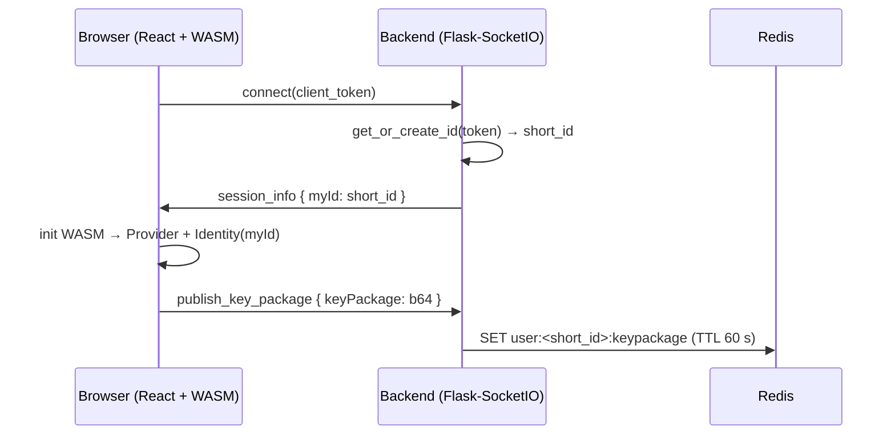
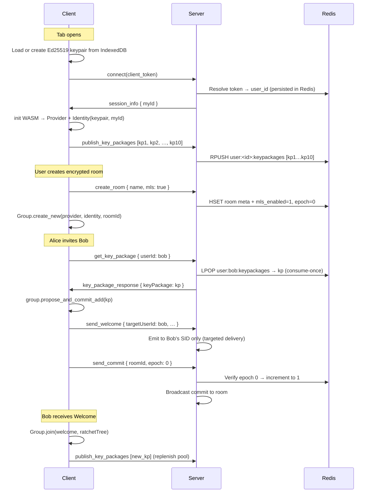

# User ↔ OpenMLS Relation — Architecture Review

> A deep review of how users are created and identified, how sessions are
> managed, and how those concepts bind to the OpenMLS KeyPackage lifecycle.
> Every finding ends with a concrete **Recommendation**.

---

## 1. Current Architecture At a Glance



### The identity chain today

| Layer | Identifier | Generated by | Lifetime |
|-------|-----------|-------------|----------|
| Transport | `request.sid` | SocketIO | Single WebSocket connection |
| Persistence token | `client_token` (6 random chars) | Browser `sessionStorage` | Until tab close |
| Application identity | `short_id = token[:6]` | Backend `get_or_create_id` | In-memory `token_to_id` dict |
| Cryptographic identity | `Identity(provider, myId)` | WASM/OpenMLS | In-memory, per page load |
| KeyPackage in Redis | `user:<short_id>:keypackage` | Backend stores client bytes | 60 seconds TTL |

---

## 2. Critical Issues

### 2.1 Identity Is Not Truly Persistent — It Is "Session‑ish"

**Problem:**
- `client_token` is a 6-char random string living in `sessionStorage`.  
  `sessionStorage` survives **refreshes** but dies when the **tab is closed**.
- The backend `token_to_id` map is a plain Python dict — it is lost on every **server restart** or re-deploy.
- The MLS `Identity` (Ed25519 keypair) is generated fresh on every page load. Even if `myId` stays the same across a refresh, the **cryptographic keypair is brand-new**, so any old MLS group the user belonged to is **unrecoverable**.

**Impact:**
After a page refresh the user publishes a **new** `KeyPackage` signed by a **new** Ed25519 key. Other group members must re-invite them through the `request_mls_welcome` flow. If the server restarts, `token_to_id` is gone and even the `short_id` mapping breaks.

**Recommendation:**

```diff
  # Instead of in-memory dict:
- token_to_id = {}
+ # Persist the mapping in Redis
+ def get_or_create_id(client_token):
+     cached = r.get(f"token:{client_token}:id")
+     if cached:
+         return cached
+     short_id = client_token[:6]
+     r.set(f"token:{client_token}:id", short_id, ex=86400)
+     return short_id
```

For the cryptographic identity, consider persisting the serialized Ed25519 keypair in `IndexedDB` on the client so the same signing key survives page reloads. OpenMLS `SignatureKeyPair` supports `tls_serialize` / `tls_deserialize`.

---

### 2.2 KeyPackage Has a 60-Second TTL — Far Too Short

**Problem:**
[`app.py` L217](file:///home/brahim/enccom_lite/backend/app.py#L217):
```python
r.set(f"user:{user_id}:keypackage", key_package_b64, ex=TTL_SECONDS)
# TTL_SECONDS = 60
```
A KeyPackage that expires after 60 seconds means:
- If Alice creates a room and tries to invite Bob 61 seconds after Bob connected, the KeyPackage is already gone.
- The retry loop in [`MlsContext.tsx` L286-295](file:///home/brahim/enccom_lite/App/src/context/MlsContext.tsx#L286-L295) does a single 300 ms retry — not nearly enough if the KeyPackage simply expired.

**Recommendation:**
1. Give KeyPackages a much longer TTL (e.g. 24 hours) or make them **non-expiring** while the user is connected.
2. Implement a **KeyPackage bundle** — store multiple pre-generated KeyPackages per user so each one can be consumed exactly once (MLS one-time use semantics).

```python
# Store a pool of KeyPackages per user
@socketio.on('publish_key_packages')
def handle_publish_keys(data):
    user_id = get_current_user_id()
    key_packages = data.get('keyPackages', [])
    for kp_b64 in key_packages:
        r.rpush(f"user:{user_id}:keypackages", kp_b64)
    r.expire(f"user:{user_id}:keypackages", 86400)  # 24h

@socketio.on('get_key_package')
def handle_get_key(data):
    target_user_id = data.get('userId')
    room_id = data.get('roomId')
    # Pop one KeyPackage from the pool (consume-once)
    kp_b64 = r.lpop(f"user:{target_user_id}:keypackages")
    emit('key_package_response', {
        'userId': target_user_id,
        'roomId': room_id,
        'keyPackage': kp_b64
    })
```

---

### 2.3 Single KeyPackage Reuse Violates MLS Protocol Semantics

**Problem:**
OpenMLS KeyPackages are designed to be **single-use**: once a KeyPackage is consumed to add a user to a group, that exact KeyPackage must **never** be used again. Currently, `r.set(…)` stores a single KeyPackage and `r.get(…)` reads it without deleting it. If two different room owners fetch Bob's KeyPackage concurrently, they receive the **same** bytes, which will cause the second `propose_and_commit_add` to fail or produce a cryptographically unsound state.

**Recommendation:**
Use the pool pattern from §2.2 above. On the client side, generate and publish **N** KeyPackages on connect:

```typescript
// MlsContext.tsx — during init
const KEY_PACKAGE_POOL_SIZE = 10;
const keyPackages: string[] = [];
for (let i = 0; i < KEY_PACKAGE_POOL_SIZE; i++) {
  const kp = mlsIdentity.key_package(mlsProvider);
  keyPackages.push(bytesToBase64(kp.to_bytes()));
}
socket.emit('publish_key_packages', { keyPackages });
```

After a KeyPackage is consumed (e.g. after joining via Welcome), replenish:

```typescript
// After joining group via welcome, publish replacement KeyPackages
socket.emit('publish_key_packages', { keyPackages: [newKpB64] });
```

---

### 2.4 Welcome Messages Are Broadcast to the Entire Room — Not Targeted

**Problem:**
[`app.py` L248](file:///home/brahim/enccom_lite/backend/app.py#L248):
```python
emit('mls_welcome', data, to=room, include_self=False)
```
The Welcome (containing encrypted group secrets) is sent to **all** sockets in the room. Every client receives it and must filter by `targetUserId` on the frontend ([`MlsContext.tsx` L160](file:///home/brahim/enccom_lite/App/src/context/MlsContext.tsx#L160)). This is:
- **Wasteful** — every peer downloads bytes they ignore.
- **Leaks metadata** — every peer learns _who_ is being invited and when.
- **Fragile** — relies on the client-side `if (data.targetUserId !== myId) return` guard for security.

**Recommendation:**
Maintain a `user_id → socket.sid` map on the server and emit Welcome directly to the target session:

```python
# Track active sessions
active_sessions = {}  # user_id → set of socket sids

@socketio.on('connect')
def handle_connect():
    user_id = get_current_user_id()
    active_sessions.setdefault(user_id, set()).add(request.sid)
    emit('session_info', {'myId': user_id})

@socketio.on('disconnect')
def handle_disconnect():
    user_id = get_current_user_id()
    if user_id in active_sessions:
        active_sessions[user_id].discard(request.sid)

@socketio.on('send_welcome')
def handle_send_welcome(data):
    target_user = data.get('targetUserId')
    if target_user in active_sessions:
        for sid in active_sessions[target_user]:
            emit('mls_welcome', data, to=sid)
```

---

### 2.5 No Server-Side Room↔MLS Group Binding

**Problem:**
The backend has **no concept** that a room is MLS-protected. The same `chat message` handler stores plaintext and ciphertext identically. The server cannot enforce that:
- Only MLS-enrolled users send messages to an encrypted room.
- Messages in an encrypted room actually carry a `ciphertext` field.
- A non-member cannot eavesdrop by simply calling `join_room`.

**Recommendation:**
Add a room-level flag and server-side validation:

```python
# When creating a private room, mark it as MLS-protected
r.hset(f"chat:room:{room_name}", "mls_enabled", "1")

@socketio.on('chat message')
def handle_message(msg):
    room = msg.get('room', 'public')
    room_meta = r.hgetall(f"chat:room:{room}")

    if room_meta.get('mls_enabled') == '1':
        # Reject if no ciphertext payload
        if not msg.get('ciphertext'):
            emit('error', {'message': 'This room requires encrypted messages'})
            return
        # Reject if sender has no published KeyPackage (proxy for MLS enrollment)
        user_id = get_current_user_id()
        if not r.exists(f"user:{user_id}:keypackages"):
            emit('error', {'message': 'You must be enrolled in MLS to send here'})
            return
    # ... proceed to store and relay
```

---

### 2.6 No Epoch / Group-State Tracking on the Server

**Problem:**
The backend blindly relays `send_commit` and `send_welcome` messages. It has no record of:
- Which epoch a room's MLS group is currently at.
- Which users are **MLS-confirmed members** vs. which merely called `join_room`.
- Whether a Commit message is out-of-order.

If two group admins send conflicting Commits simultaneously (race condition), the server has no way to order or reject them.

**Recommendation:**
Store a lightweight epoch counter per room in Redis:

```python
@socketio.on('send_commit')
def handle_send_commit(data):
    room = data.get('roomId')
    expected_epoch = data.get('epoch')

    # Atomic compare-and-increment
    current = r.get(f"room:{room}:epoch") or "0"
    if expected_epoch is not None and int(expected_epoch) != int(current):
        emit('epoch_conflict', {'roomId': room, 'serverEpoch': current})
        return

    r.incr(f"room:{room}:epoch")
    emit('mls_commit', data, to=room, include_self=False)
```

---

## 3. The Ideal User↔OpenMLS Lifecycle

Below is the improved lifecycle that addresses all the issues above:



---

## 4. Summary of Recommendations

| # | Issue | Severity | Recommendation |
|---|-------|----------|----------------|
| 1 | `token_to_id` is in-memory only | 🔴 High | Move to Redis with 24h TTL |
| 2 | MLS Identity (keypair) lost on every page load | 🔴 High | Persist keypair in IndexedDB; restore on reload |
| 3 | KeyPackage TTL is 60 seconds | 🔴 High | Increase to 24h or make non-expiring while connected |
| 4 | Single KeyPackage reuse violates MLS spec | 🔴 High | Store a pool; consume-once with `LPOP` |
| 5 | Welcome broadcast to entire room | 🟡 Medium | Target delivery to specific socket SID |
| 6 | No server-side room↔MLS binding | 🟡 Medium | Add `mls_enabled` flag; validate messages server-side |
| 7 | No epoch tracking on server | 🟡 Medium | Store epoch in Redis; reject stale Commits |
| 8 | No retry / exponential backoff for KeyPackage fetch | 🟢 Low | Replace single 300 ms timeout with exponential backoff (3 retries) |
| 9 | `client_token` is only 6 chars (low entropy) | 🟢 Low | Use `crypto.randomUUID()` for 128-bit token |
| 10 | No cleanup of MLS state on `delete_room` | 🟢 Low | Emit `mls_group_destroyed` so clients purge local groups |

---

## 5. File Reference

| File | Role |
|------|------|
| [`backend/app.py`](file:///home/brahim/enccom_lite/backend/app.py) | Server: identity resolution, KeyPackage storage, MLS relay |
| [`App/src/context/SocketContext.tsx`](file:///home/brahim/enccom_lite/App/src/context/SocketContext.tsx) | Client: token generation, socket connection, `myId` state |
| [`App/src/context/MlsContext.tsx`](file:///home/brahim/enccom_lite/App/src/context/MlsContext.tsx) | Client: WASM init, KeyPackage lifecycle, group ops, encrypt/decrypt |
| [`App/src/utils/mlsUtils.ts`](file:///home/brahim/enccom_lite/App/src/utils/mlsUtils.ts) | Client: Base64 ↔ Uint8Array helpers |
| [`openmls-wasm/src/lib.rs`](file:///home/brahim/enccom_lite/openmls-wasm/src/lib.rs) | WASM: Provider, Identity, Group, KeyPackage, RatchetTree bindings |

---

*Generated from a full review of the enccom_lite codebase — Sept 2026.*
