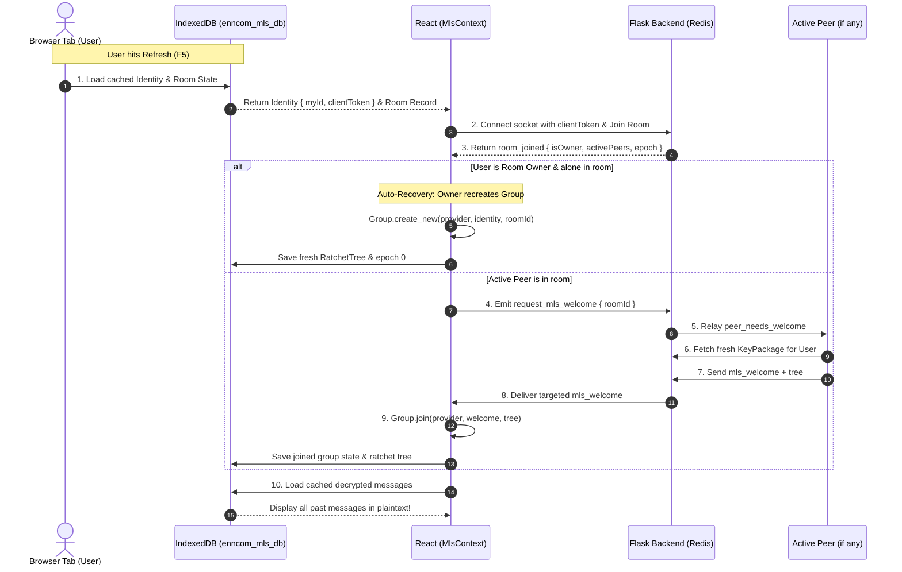

# IndexedDB Client-Side Cryptographic Persistence (`indexdb.md`)

## 1. Overview & Purpose
In **enccom_lite**, End-to-End Encryption (E2EE) is powered by OpenMLS running inside WebAssembly (`openmls-wasm`). 

By default, WebAssembly memory and JavaScript state exist only in RAM. When a user refreshes the browser (F5 / Ctrl+R), all in-memory cryptographic state (`Provider`, `Identity`, `Group` instances, and decrypted chat messages) are wiped.

**Solution 2** introduces **IndexedDB** as a persistent client-side storage engine to preserve:
1. **Cryptographic Identity & Tokens** (`identity` store): Preserves client identity, persistent session token, and active KeyPackage metadata.
2. **Room MLS Group State** (`rooms` store): Preserves room metadata, owner designation, current epoch counter, and base64 exported Ratchet Trees across reloads.
3. **Decrypted Message Vault** (`messages` store): Caches locally decrypted plaintext messages so that historical messages remain readable after page refresh without requiring repeated key derivation.

---

## 2. Database Schema (`enncom_mls_db`)

The database is versioned (`v1`) and contains three object stores:

```
enncom_mls_db
├── identity_store   (Key: "current")
├── rooms_store      (KeyPath: "roomId")
└── messages_store   (KeyPath: "id", Index: "roomId")
```

### Store 1: `identity_store`
Stores the local client's persistent identity and cryptographic session credentials.
* **Key**: `"current"`
* **Value Schema**:
```typescript
interface MlsIdentityRecord {
  id: 'current';
  clientToken: string;           // UUIDv4 persistent client token
  myId: string;                  // Short user ID derived/assigned by server (e.g. "a1b2c3")
  createdAt: number;             // Timestamp of creation
  lastSeenAt: number;            // Timestamp of last activity
  publishedKeyPackagesCount: number; // Number of key packages registered with server
}
```

### Store 2: `rooms_store`
Tracks the cryptographic state of each MLS-enabled room the user participates in.
* **KeyPath**: `roomId` (e.g. `"room_8f21bc9a"`)
* **Value Schema**:
```typescript
interface MlsRoomRecord {
  roomId: string;                // Primary key
  name: string;                  // Room display name
  owner: string;                 // User ID of the room creator
  isOwner: boolean;              // True if local user created this room
  epoch: number;                 // Last confirmed MLS group epoch
  hasGroup: boolean;             // Whether group was active prior to refresh
  ratchetTree?: string;          // Base64 serialized RatchetTree export
  lastWelcome?: string;          // Base64 serialized Welcome payload
  updatedAt: number;             // Timestamp of last update
}
```

### Store 3: `messages_store`
Serves as an offline local message vault. Whenever an encrypted message is decrypted by the MLS group, its plaintext is cached here.
* **KeyPath**: `id` (e.g. `"room_8f21bc9a:10"`)
* **Index**: `roomId`
* **Value Schema**:
```typescript
interface MlsCachedMessage {
  id: string;                    // Compound key `${roomId}:${msgId}`
  roomId: string;                // Room identifier
  senderId: string;              // Sender user ID
  text: string;                  // Decrypted plaintext message
  ciphertext?: string;           // Original raw ciphertext
  timestamp: number;             // Message timestamp
}
```

---

## 3. Lifecycle Across Page Refresh



---

## 4. Key Advantages of Solution 2
1. **Instant Decryption of Past History**: Unlike pure in-memory systems where refreshing causes previous messages to read `[Encrypted Message]`, IndexedDB allows immediate offline rendering of the user's decrypted conversation.
2. **Deterministic Owner Recovery**: If the creator refreshes, their ownership status is verified from both IndexedDB and server, allowing instantaneous group re-initialization without waiting for offline peers.
3. **Clean Cache Management**: Group state is purged when a room is deleted, preventing orphan data.
4. **Enhanced Debuggability**: Cryptographic state transitions and epoch progression can be audited directly in browser DevTools under `Application -> IndexedDB -> enncom_mls_db`.
